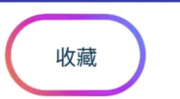
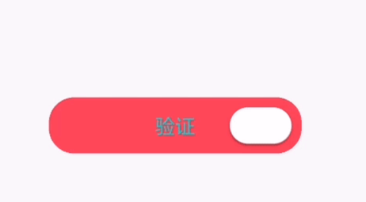
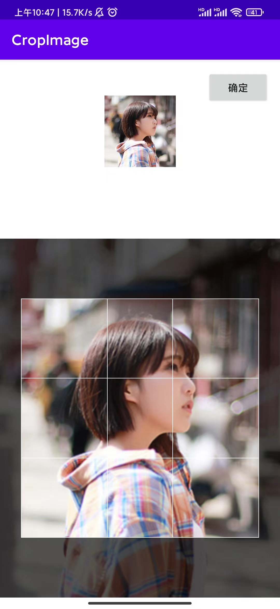
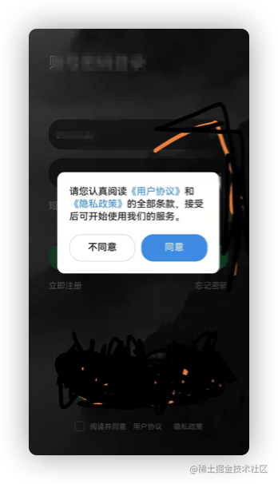

# CommonExamples
常用小示例

#### app下
实现跑马灯首尾相接的效果
9c010ea817ff290351d9d1033e386c73.mov
自定义三色渐变圆角按钮

聊天界面的气泡状的ImageView

滑动验证效果的自定义view-MyCheckView

#### baseviewbinging
 viewbinging的基本使用(包含include，merge，ViewStub标签，fragment,adapter,dialog,自定义view场景)
 以及recycleview自定义实现流式布局

#### cropimage
裁剪图片功能

#### mvpdemo
 mvp小示例

#### mvvmdemo
 mvvm架构的登录小示例

#### privacydialogdemo
 隐私协议组件
 

#### shortcutsdemo
 桌面APP图标长按快捷方式入口
 

#### autosizedemo
 autosize在activity，fragment，dialog中的使用以及改变显示字体

#### imagedemo
 图片实现圆角方式：
 1.clipPath
 2.BitmapShader
 3.Xfermode
 4.ViewOutlineProvider

#### rvdemo
recycleview内容显示在底部效果以及类似打赏榜view叠落样式
正常显示：
11652341059_.pic.jpg
效果显示：
21652341060_.pic.jpg

#### servicedemo
bindService代码实现以及安装apk示例

#### databasedemo
https://juejin.cn/post/6951377130777215012
数据库存储，greendao,room使用示例

#### animatordemo
 常用属性动画示例
 仿微信边界回弹动画效果

#### scrolltv
用EditText或自定义TextView实现 可固定行数显示，超出内容上下滑动的TextView效果
1652774180414686.mp4

#### regdemo
识别字符串中的中文和数字用不同样式显示

#### ThreadPoolExecutorDemo
